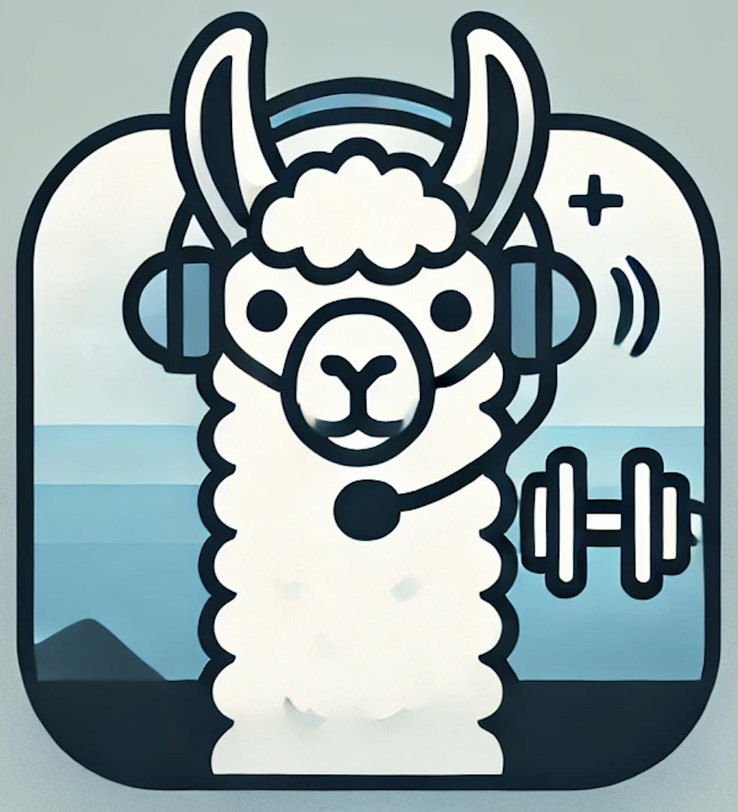

<div align="center">
  
</div>

<p align='center'>
    <h1 align="center">LLamaFit</h1>
    <p align="center">
    Project for Human Machine Dialogue at the University of Trento A.Y.2024/2025
    </p>
    <p align='center'>
    Developed by:
    Roman Simone 
    </p>   
</p>


<p align="center">
  
</p>

----------

- [Project description](#project-description)
  - [🚀 Features](#-features)
  - [⚙️ How It Works](#️-how-it-works)
- [Installation](#installation)
- [How to run](#how-to-run)
- [Contact](#contact)

----------

# Project description

**LLamaFit** is a human-machine dialogue system designed to help users plan and manage their workout programs. It provides **personalized training schedules, exercise recommendations, and favorite exercise management**, acting as a virtual personal trainer.

---

## 🚀 Features
✅ **Personalized Workout Plans** – Generate structured training schedules based on user input.  
✅ **Exercise Recommendations** – Find specific exercises based on body part, difficulty level, and available equipment.  
✅ **Favorite Exercises Management** – Add, remove, and list favorite exercises for quick access.  
✅ **User Interaction** – Provides clear and coherent responses while maintaining conversational flow.  
✅ **Feedback Collection** – Allows users to evaluate the system and provide improvement suggestions.  

---

## ⚙️ How It Works
LLamaFit is built using **LLama 3**, running locally with **Ollama**, and follows a structured conversational pipeline:

1️⃣ **NLU (Natural Language Understanding):** Extracts user intent and relevant details (slots).  
2️⃣ **DM (Dialogue Manager):** Keeps track of the conversation state and selects the next best action.  
3️⃣ **NLG (Natural Language Generation):** Generates human-like responses based on the retrieved information.  

---

# Installation
  > [!NOTE]
> For all project we use python 3.10

To run LLamaFit locally, follow these steps:
- Clone the repo: 
    ```bash
    git clone https://github.com/Roman-Simone/human-machine-dialogue
    ```

- Install ollama follow the instruction in this <a href="https://ollama.com/download">link</a>
- Install LLama3 with this command:
    ```bash
    ollama run llama3
    ```

# How to run

In order to run the chat with LLamafit launch:
```bash
    python3 main.py
```

# Contact
For any inquiries, feel free to contact:

- Simone Roman - [simone.roman@studenti.unitn.it](mailto:simone.roman@studenti.unitn.it)

- Christian Moiola - [christian.moiola@studenti.unitn.it](mailto:christian.moiola@studenti.unitn.it)


<br>

<div>
    <a href="https://www.unitn.it/">
        
    </a>
</div>


